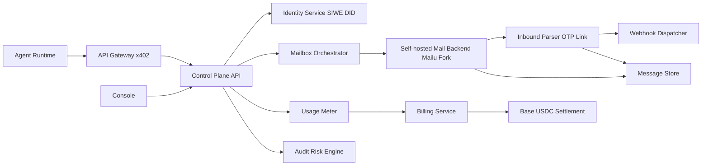

# Agent Mail Cloud 開發文檔（V1）

## 1. 目標與範圍

### 1.1 產品目標
- 提供給 AI Agent 的可程式化雲郵箱能力。
- 支持大量註冊場景的郵箱分配、驗證碼提取、事件推送。
- 用 Base 鏈身份（DID）+ USDC 支付（x402）完成身份與收費閉環。

### 1.2 V1 範圍（In Scope）
- SIWE 登入與 DID 映射。
- 郵箱池分配/回收。
- 收件解析（OTP/驗證連結）。
- 3 個付費 API（x402）：
  - `POST /v1/mailboxes/allocate`
  - `GET /v1/messages/latest`
  - `POST /v1/webhooks`
- 用量計量與賬單查詢。
- 審計與基礎風控（限流、配額、黑名單域名）。

### 1.3 V1 非目標（Out of Scope）
- 完整發信能力（SMTP Outbound）
- 複雜 RBAC（只做基礎租戶隔離）
- 鏈上複雜金融合約（僅 USDC 收款與賬單錨定）

## 2. 總體架構

### 2.1 核心模塊
- API Gateway（x402）
  - 支付挑戰（402）
  - 認證前置與限流
- Control Plane API
  - 對外業務 API 聚合
- Identity Service
  - SIWE 驗簽
  - DID 映射：`did:pkh:eip155:8453:<address>`
- Mailbox Orchestrator
  - 郵箱池生命周期管理
- Mail Backend
  - 自建並修改的 Mailu 郵件底座
  - 不依賴第三方託管郵箱 API
  - 對 Control Plane 暴露內部集成接口
- Inbound Parser
  - OTP、驗證鏈接提取
- Usage Meter + Billing
  - 計量、出賬、鏈上結算映射
- Audit & Risk
  - 全鏈路審計與反濫用策略

## 3. 技術選型

### 3.1 建議技術棧
- 語言：TypeScript（Node.js 20+）
- API：Express/Fastify
- DB：PostgreSQL 15+
- Queue：Redis + BullMQ（或 RabbitMQ）
- 郵件底座：自建 Mailu Fork（MVP 快速落地，後續按產品需求改造）
- 對象存儲：S3 兼容（存 raw message）
- 鏈上：Base（8453 / 84532）
- 支付：x402 + USDC

### 3.2 依賴組件
- Coinbase CDP SDK（Server Wallet v2）
- x402（seller middleware）
- SIWE 驗簽庫
- OpenTelemetry（可選，建議）

### 3.3 Mailu 定位與邊界
- Mailu 是本項目的郵件數據面，不是外部 SaaS 依賴。
- 我們以開源 Mailu 為基礎自行部署、維護與修改。
- `mailagents` 是控制面，負責身份、配額、計費、審計、風控與對外 API。
- Mailu fork 負責真實域名、郵箱賬號/別名、SMTP/IMAP/存儲、入站事件。
- `mailagents` 與 Mailu 之間使用內部接口對接，而不是以“第三方郵件服務商”方式集成。

### 3.4 開發原則（之後一律按此執行）
- 任何“正式郵箱功能”優先落在 Mailu fork，而不是臨時 mock 或第三方轉發方案。
- `MAILBOX_DOMAIN` 只能視為控制面配置，不代表真實收信能力已完成。
- 新增與郵箱生命周期、入站收信、原文存取、事件同步相關的需求時，先更新 Mailu fork 設計文檔，再寫代碼。
- 如需增加臨時適配層，必須明確標註其為過渡實現，不得替代最終 Mailu fork 架構。

## 4. 身份與權限設計

### 4.1 認證流程（SIWE）
1. 客戶端請求 challenge。
2. 後端返回 nonce + message。
3. 錢包簽名 message。
4. 後端驗簽成功，簽發短期 JWT。

### 4.2 DID 模型
- 主 DID：`did:pkh:eip155:8453:<wallet_address>`
- 測試網：`did:pkh:eip155:84532:<wallet_address>`
- 一個 tenant 可綁多 wallet identity。

### 4.3 授權規則
- Token 必須帶：`tenant_id`, `agent_id`, `scopes`。
- API 層做租戶隔離與資源歸屬校驗。

## 5. 收費與結算設計

### 5.1 x402 接入原則
- 對高價值 API 啟用 `402 Payment Required`。
- Payment proof 驗證成功後放行。

### 5.2 計費策略（V1）
- 套餐 + 超額。
- V1 先按端點次數計費。
- `usage_records` 保存原始計量事件，可重算。

### 5.3 鏈上與鏈下分層
- 鏈下：用量、賬單明細、業務規則。
- 鏈上：USDC 收款記錄、賬單哈希錨定。

## 6. API 規範（V1）

### 6.1 認證
- `POST /v1/auth/siwe/challenge`
- `POST /v1/auth/siwe/verify`

### 6.2 郵箱
- `POST /v1/mailboxes/allocate`（付費）
- `POST /v1/mailboxes/release`

### 6.3 消息
- `GET /v1/messages/latest`（付費）

### 6.4 Webhook
- `POST /v1/webhooks`（付費）

### 6.5 計費
- `GET /v1/usage/summary`
- `GET /v1/billing/invoices/{invoice_id}`

### 6.6 錯誤碼約定
- `401` 未認證
- `403` 無權限
- `402` 需支付（x402）
- `404` 資源不存在
- `409` 狀態衝突
- `429` 限流
- `5xx` 服務端錯誤

## 7. 數據模型

### 7.1 核心表
- `tenants`
- `wallet_identities`
- `agents`
- `mailboxes`
- `mailbox_leases`
- `messages`
- `message_events`
- `webhooks`
- `usage_records`
- `invoices`
- `payment_receipts`
- `audit_logs`

### 7.2 狀態機
- mailbox
  - `available -> leased -> released|expired`
  - `leased -> frozen`（風控觸發）
- invoice
  - `draft -> issued -> paid|void`

## 8. 異步事件與隊列

### 8.1 事件定義
- `mail.received`
- `mail.parsed`
- `otp.extracted`
- `mailbox.allocated`
- `mailbox.released`
- `usage.recorded`
- `invoice.finalized`
- `payment.confirmed`
- `risk.flagged`

### 8.2 重試策略
- Webhook 投遞：指數退避，最多 8 次。
- Parser 任務：最多 3 次，失敗進 dead-letter queue。

### 8.3 Mailu 內部事件對接
- Mailu fork 應在新郵件入站後生成內部事件。
- `mailagents` parser/dispatcher worker 消費該事件並寫入：
  - `messages`
  - `message_events`
  - `audit_logs`
- `messages/latest` 不應直接依賴第三方 webhook 轉發結果，而應依賴 Mailu 真實入站數據。

## 9. 安全與合規

### 9.1 安全要求
- 傳輸全程 TLS。
- 敏感字段加密（secret、token、raw_ref metadata）。
- Webhook 簽名（HMAC-SHA256）。

### 9.2 反濫用
- 每 tenant QPS 限制。
- 每 agent 每小時 allocate 次數上限。
- 風險域名策略（denylist/allowlist）。

### 9.3 數據治理
- 默認保留 30 天。
- 支持刪除請求與審計留痕。

## 10. 可觀測性

### 10.1 指標
- API 成功率、p95/p99 延遲
- 新郵件到 OTP 提取耗時
- webhook 成功率
- 402 轉支付成功率

### 10.2 日誌
- 需包含：`request_id`, `tenant_id`, `agent_id`, `mailbox_id`。
- 禁止在明文日誌寫入完整郵件正文。

## 11. 開發環境與部署

### 11.1 環境變量（最小）
- `NODE_ENV`
- `DATABASE_URL`
- `REDIS_URL`
- `JWT_SECRET`
- `CDP_API_KEY_ID`
- `CDP_API_KEY_SECRET`
- `CDP_WALLET_SECRET`
- `X402_FACILITATOR_URL`
- `USDC_TOKEN_ADDRESS`
- `BASE_CHAIN_ID`

### 11.2 環境分層
- `dev`：Base Sepolia（84532）
- `staging`：Base Sepolia + 真實壓測
- `prod`：Base Mainnet（8453）

### 11.3 部署建議
- 單體 API + 模塊化內聚（V1）
- Parser/Dispatcher 走獨立 worker
- PostgreSQL 主從 + 每日備份
- Mailu fork 獨立部署，作為內部郵件基礎設施
- `api.<domain>` 與 `inbox.<domain>` 分離，前者給 Control Plane，後者給 Mailu

## 12. 里程碑計劃（8 週）

### 里程碑 M1（第 1-2 週）
- SIWE + DID + JWT
- tenants/agents/mailboxes 基礎模型
- allocate/release API

### 里程碑 M2（第 3-4 週）
- Mailu fork 打通
- parser 提取 OTP/link
- messages/latest API

### 里程碑 M3（第 5-6 週）
- x402 接入 3 個付費端點
- usage meter + invoice 生成

### 里程碑 M4（第 7-8 週）
- webhook 重試機制
- 審計與風控最小版
- 灰度驗收與壓測

## 13. 驗收標準（V1）
- Agent 可在 2 秒內拿到可用郵箱（p95）。
- 新郵件到 OTP 抽取完成 < 5 秒（p95）。
- 付費端點 402 流程成功率 > 99%。
- Webhook 投遞成功率 > 99%（含重試）。
- 任一操作可在審計表按 `request_id` 回放。

## 14. 已知風險與對策
- 郵件投遞信譽風險
  - 對策：先收件場景，不擴展發信；域名策略嚴控。
- 濫用風險
  - 對策：租戶準入、配額、黑名單、審計。
- 鏈上支付體驗波動
  - 對策：支持預充值與離峰結算。

## 15. 後續文檔清單
- `docs/openapi.yaml`（完整 API 契約）
- `docs/db/schema.sql`（DDL）
- `docs/runbooks/incident.md`（故障手冊）
- `docs/security/threat-model.md`（威脅模型）
- `docs/mailu-fork-architecture.md`（Mailu fork 邊界與內部集成）

## 16. 相關文檔
- `docs/admin-dashboard.md`（後台 IA、權限、流程）
- `docs/mailu-fork-architecture.md`（今後涉及郵箱能力的主設計文檔）
- `docs/openapi-admin.yaml`（Admin API 契約）

- `docs/openapi.yaml`（業務 API 契約）
- `docs/db/schema.sql`（可執行 DDL）
