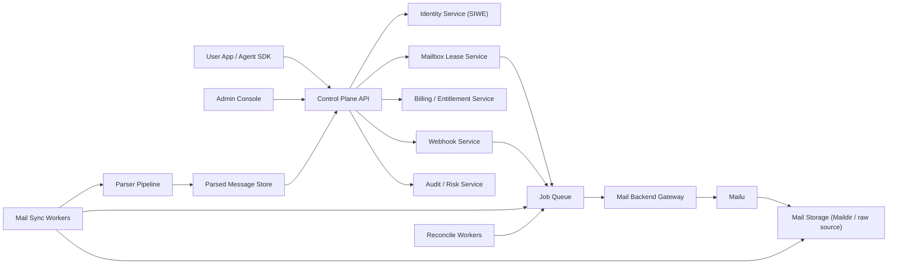

# Agent Mail Cloud Redesign

## 1. Redesign Goal

This document defines the redesign baseline for the next major version of Agent Mail Cloud.

The redesign corrects the biggest architectural issue from V1:

- V1 mixed control-plane concerns, mail backend concerns, and sync concerns too early
- V2 must separate those concerns explicitly from the first iteration

The target system is a programmable mailbox platform for agents with:

- wallet-based identity
- mailbox lifecycle orchestration
- real inbound and outbound mail
- parser-backed message extraction
- operator and tenant control surfaces
- production-first operational behavior

## 2. Design Principles

### 2.1 Control plane and mail plane must be separate
- `mailagents-control` owns identity, tenancy, lease policy, billing, webhook, audit, and operator UX.
- `mail-backend-gateway` owns mailbox provisioning, password resets, backend state lookup, and mail-provider-specific integration.
- Mailu remains the mail data plane, not the business API.

### 2.2 Async work must be first-class
- Provisioning, release, mail ingest, reparse, reconciliation, and webhook delivery must run through jobs.
- Public API handlers should record intent and return quickly.
- Long-running backend work should never depend on request lifetime.

### 2.3 Mailbox account and mailbox lease are different resources
- A real mailbox account is a backend resource.
- A lease is a product-level assignment of that resource to a tenant or agent.
- V2 should model both explicitly.

### 2.4 Production behavior should be the default model
- `strict` SIWE is the baseline, not a later migration target.
- Real payment entitlement should be abstracted behind a policy layer, not exposed as a raw frontend concern.
- Deliverability requirements must be part of initial deployment acceptance, not an afterthought.

### 2.5 One primary deployment path
- V2 should optimize for one main runtime path first:
  - single-region Docker deployment
  - control plane + workers + PostgreSQL + Redis + Mailu
- Alternative runtimes are secondary and must not shape the core design.

## 3. Target Topology

## 4. Core Services

## 4.1 Control Plane API
Owns:
- tenant and agent identity
- JWT/session issuance
- mailbox lease API
- message read API
- send-mail API contract
- webhook registration
- usage and billing read models
- admin APIs

Does not own:
- SMTP/IMAP protocol handling
- Maildir traversal logic
- backend mailbox password storage rules
- provider-specific mail state transitions

## 4.2 Mail Backend Gateway
This is the missing stable seam that V1 did not formalize early enough.

Owns:
- provision mailbox account
- enable/disable mailbox account
- reset mailbox password
- lookup mailbox backend status
- send mail through authenticated submission
- emit mailbox lifecycle events to the queue

It may call Mailu APIs, Mailu admin commands, or mailbox-side integration scripts, but the control plane should not depend on those details.

Suggested internal methods:
- `provisionMailboxAccount`
- `disableMailboxAccount`
- `resetMailboxPassword`
- `getMailboxAccount`
- `sendMailboxMessage`
- `listBackendMailboxChanges`

## 4.3 Mail Sync Workers
Owns:
- mail ingest from Maildir or backend event feed
- dedupe by backend message id
- raw message persistence reference
- parser trigger creation

This service should be isolated from user request handling.

## 4.4 Parser Pipeline
Owns:
- plain text extraction
- HTML normalization
- OTP extraction
- verification link extraction
- parser versioning
- parse confidence and failure states
- reparse support for historical messages

## 4.5 Reconciliation Workers
Owns:
- mailbox account vs mailbox lease consistency checks
- backend status mismatch detection
- safe auto-repair rules
- orphaned mailbox discovery
- stuck job recovery markers

## 5. Public Product Model

## 5.1 Tenant
A billable organization boundary.

## 5.2 Agent
An application identity within a tenant.

## 5.3 Mailbox Account
A real backend mailbox that can:
- receive mail
- authenticate via IMAP/SMTP/Webmail
- exist independently of any current lease

## 5.4 Mailbox Lease
A time-bounded product assignment of a mailbox account to a tenant or agent.

## 5.5 Message
A normalized user-facing record for querying inbound mail and parsed results.

## 5.6 Send Attempt
A first-class outbound record with:
- sender mailbox
- recipients
- submission status
- provider queue id
- final delivery state if available

## 6. Recommended API Shape

## 6.1 Auth
- `POST /v2/auth/siwe/challenge`
- `POST /v2/auth/siwe/verify`
- no mock fallback in user-facing deployments

## 6.2 Mailboxes
- `POST /v2/mailboxes/leases`
- `POST /v2/mailboxes/leases/{lease_id}/release`
- `GET /v2/mailboxes/accounts`
- `POST /v2/mailboxes/accounts/{account_id}/credentials/reset`

The redesign splits account visibility from lease lifecycle.

## 6.3 Messages
- `GET /v2/messages`
- `GET /v2/messages/{message_id}`
- `POST /v2/messages/send`
- `GET /v2/send-attempts`
- `GET /v2/send-attempts/{send_attempt_id}`

## 6.4 Webhooks
- `POST /v2/webhooks`
- `GET /v2/webhooks`
- `POST /v2/webhooks/{webhook_id}/rotate-secret`

## 6.5 Admin
- Overview and operational APIs remain separate from tenant APIs.
- Admin authentication should remain independent from tenant JWTs.

## 7. Message Lifecycle

### 7.1 Inbound
1. Mailu accepts mail.
2. Mail backend gateway or sync worker discovers the message.
3. Raw message reference is recorded.
4. A deduped ingest job is created.
5. Parser runs asynchronously.
6. Parsed result is written separately from the canonical message record.
7. Webhook delivery jobs are enqueued.

### 7.2 Outbound
1. User or agent calls `POST /messages/send`.
2. API validates lease ownership and entitlement.
3. API creates a `send_attempt` in `queued` state.
4. Send job is enqueued.
5. Mail backend gateway submits through authenticated SMTP.
6. Result is persisted with backend queue id / SMTP response.
7. Follow-up status polling may update final delivery state later.

## 8. Auth and Payment Redesign

## 8.1 SIWE
- `strict` SIWE only in staging and production.
- Address normalization must happen server-side before challenge generation.
- Frontend wallet UX must be explicit about connect, switch network, and sign steps.

## 8.2 Payment and Entitlement
V2 should stop exposing payment-proof mechanics directly to user-facing UX.

Recommended split:
- entitlement engine answers whether an operation is allowed
- billing engine records usage
- payment integration settles account-level balances

Entitlement should include a cold-start cooldown: if a tenant has no bound wallet identity and is within 24 hours of creation, cap outbound send at 10 messages and return `429 cooldown_limit` with a bind-wallet hint.

If x402 remains useful at the transport layer, keep it behind the API gateway. The control plane and frontend should think in terms of entitlement, not raw proofs.

## 9. Deployment Recommendation

## 9.1 Preferred V2 shape
- `nginx`
- `control-plane-api`
- `job-worker`
- `mail-sync-worker`
- `postgres`
- `redis`
- `mailu`

## 9.2 Why Redis becomes mandatory
Redis or equivalent queue infrastructure is required in V2 because async work is no longer optional.

## 9.3 Why Cloudflare Worker should not be the primary runtime
The control plane may expose some edge endpoints later, but the primary product depends on:
- PostgreSQL
- Redis-backed jobs
- Mailu integration
- long-lived operational infrastructure

That makes a VPS or container platform the correct first-class runtime.

## 10. Migration Strategy from V1

### 10.1 Keep what is good
Keep:
- SIWE and JWT concepts
- admin and user surfaces
- current public business domain
- mailbox send/read capabilities
- Postgres as primary store

### 10.2 Replace or refactor
Refactor:
- current mailbox storage model into account + lease
- current send path into queued send attempts
- current Maildir sync into dedicated sync workers
- current reconciliation into worker-driven repair workflows

### 10.3 Do not big-bang rewrite
Recommended sequence:
1. introduce new tables and read/write models
2. introduce queue and workers
3. move provisioning and send into async jobs
4. move parser state into versioned parse tables
5. migrate APIs from V1 behavior to V2 behavior gradually

## 11. Acceptance Criteria for the Redesign

The redesign is successful only if:
- mailbox accounts can exist without active leases
- lease state changes do not directly depend on synchronous Mailu responses
- inbound messages are deduped and reparsable
- outbound messages are auditable as first-class records
- SIWE is strict everywhere outside local development
- operational recovery is queue- and reconciliation-driven
- a new engineer can understand service boundaries without reading deployment history

## 12. Non-Goals

This redesign does not try to:
- replace Mailu with a new mail server
- implement multi-region mail routing yet
- solve full enterprise RBAC
- redesign the business model

It focuses on making the current product architecture coherent, operable, and extensible.
