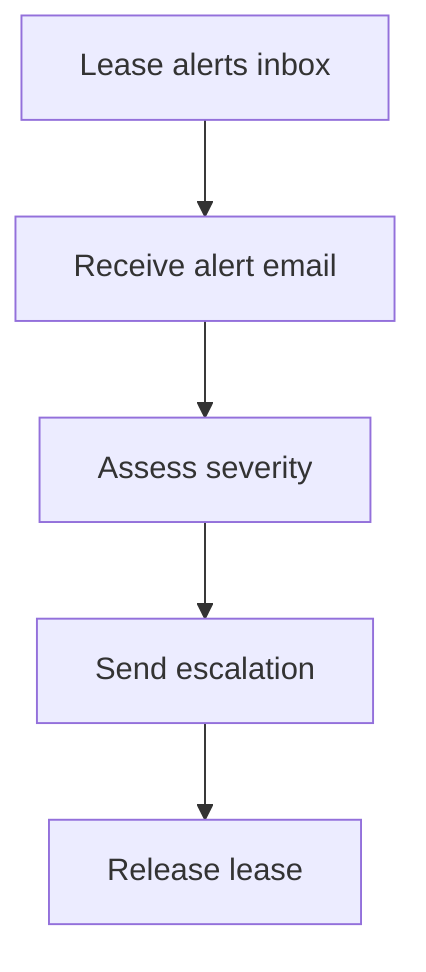

# Demo: Alerts Escalation Agent

This demo allocates an alerts inbox, watches for high-severity notifications, and sends escalation notices.

## Setup (10 minutes)

1. Set environment variables:

```bash
cp .env.example .env
```

2. Use `docs/quickstart.md` to obtain a JWT and `agent_id`.

## Flow

The demo script:

- allocates a lease with purpose `alerts`
- prints the leased inbox address
- optionally sends an escalation email if `TO_EMAIL` is set
- releases the lease



## Expected Outcome

- Alert emails are received by the leased inbox.
- Escalation emails are sent successfully.
- Lease is released after completion.
